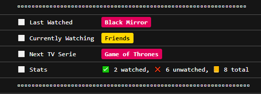
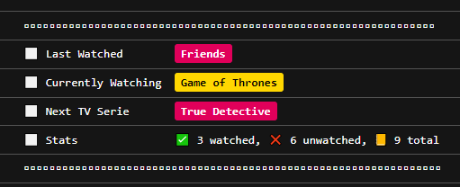

# Week 4, Task 1


## Case 1
```
const mySeriesTracker = new SeriesTracker(series);
mySeriesTracker.printSeriesReport();
```
### Output:



***
## Case 2
```
const mySeriesTracker = new SeriesTracker(series);
mySeriesTracker.finishSerie();
mySeriesTracker.printSeriesReport();
```
### Output:


***
## Case 3
```
const mySeriesTracker = new SeriesTracker(series);
const newSerie = {
  id: "9",
  name: "Lost",
  genre: "Adventure",
  directorId: "4"
};
mySeriesTracker.add(newSerie);
mySeriesTracker.printSeriesReport();
```

### Output:



***